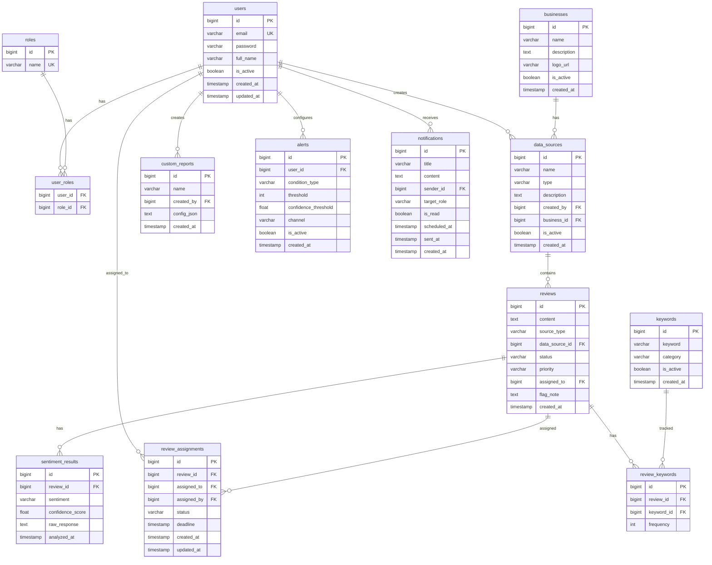

# Database Design - Sentiment Analysis Dashboard

## 1. Tổng Quan

- **Database:** PostgreSQL
- **ORM:** JPA/Hibernate
- **Số bảng:** 10 bảng chính
- **Quan hệ:** Sử dụng foreign keys, soft delete cho các entity quan trọng

---

## 2. ERD (Entity Relationship Diagram)



---

## 3. Chi Tiết Từng Bảng

### 3.1. `users` – Thông tin người dùng

| Cột | Kiểu | Ràng buộc | Mô tả |
|-----|------|-----------|-------|
| `id` | BIGINT | PK, AUTO_INCREMENT | ID người dùng |
| `email` | VARCHAR(255) | UNIQUE, NOT NULL | Email đăng nhập |
| `password` | VARCHAR(255) | NOT NULL | Mật khẩu (BCrypt hash) |
| `full_name` | VARCHAR(100) | NOT NULL | Họ tên đầy đủ |
| `is_active` | BOOLEAN | DEFAULT true | Trạng thái tài khoản |
| `created_at` | TIMESTAMP | DEFAULT NOW() | Ngày tạo |
| `updated_at` | TIMESTAMP | | Ngày cập nhật |

### 3.2. `roles` – Vai trò người dùng

| Cột | Kiểu | Ràng buộc | Mô tả |
|-----|------|-----------|-------|
| `id` | BIGINT | PK, AUTO_INCREMENT | ID vai trò |
| `name` | VARCHAR(50) | UNIQUE, NOT NULL | Tên vai trò: ANALYST, MANAGER, ADMIN |

> **Dữ liệu mặc định:** 3 records: ANALYST, MANAGER, ADMIN

### 3.3. `user_roles` – Liên kết users - roles (Many-to-Many)

| Cột | Kiểu | Ràng buộc | Mô tả |
|-----|------|-----------|-------|
| `user_id` | BIGINT | FK → users(id), NOT NULL | ID người dùng |
| `role_id` | BIGINT | FK → roles(id), NOT NULL | ID vai trò |

> **Primary Key:** Composite (user_id, role_id)

### 3.4. `businesses` – Thông tin doanh nghiệp

| Cột | Kiểu | Ràng buộc | Mô tả |
|-----|------|-----------|-------|
| `id` | BIGINT | PK, AUTO_INCREMENT | ID doanh nghiệp |
| `name` | VARCHAR(200) | NOT NULL | Tên doanh nghiệp |
| `description` | TEXT | | Mô tả |
| `logo_url` | VARCHAR(500) | | URL logo |
| `is_active` | BOOLEAN | DEFAULT true | Trạng thái |
| `created_at` | TIMESTAMP | DEFAULT NOW() | Ngày tạo |

### 3.5. `data_sources` – Nguồn dữ liệu

| Cột | Kiểu | Ràng buộc | Mô tả |
|-----|------|-----------|-------|
| `id` | BIGINT | PK, AUTO_INCREMENT | ID nguồn dữ liệu |
| `name` | VARCHAR(200) | NOT NULL | Tên nguồn (e.g., "Google Reviews Q1") |
| `type` | VARCHAR(50) | NOT NULL | Loại: CSV, EXCEL, GOOGLE, FACEBOOK |
| `description` | TEXT | | Mô tả chi tiết |
| `created_by` | BIGINT | FK → users(id) | Người tạo (Manager) |
| `business_id` | BIGINT | FK → businesses(id) | Thuộc doanh nghiệp nào |
| `is_active` | BOOLEAN | DEFAULT true | Trạng thái (soft delete) |
| `created_at` | TIMESTAMP | DEFAULT NOW() | Ngày tạo |

### 3.6. `reviews` – Dữ liệu reviews

| Cột | Kiểu | Ràng buộc | Mô tả |
|-----|------|-----------|-------|
| `id` | BIGINT | PK, AUTO_INCREMENT | ID review |
| `content` | TEXT | NOT NULL | Nội dung review (từ cột `Comment` của dataset) |
| `source_type` | VARCHAR(50) | | Loại nguồn gốc |
| `data_source_id` | BIGINT | FK → data_sources(id) | Thuộc nguồn dữ liệu nào |
| `status` | VARCHAR(30) | DEFAULT 'NEW' | Trạng thái: NEW, FLAGGED, ASSIGNED, IN_PROGRESS, RESOLVED |
| `priority` | VARCHAR(20) | | Mức ưu tiên: HIGH, MEDIUM, LOW |
| `assigned_to` | BIGINT | FK → users(id), NULLABLE | Người được giao xử lý |
| `flag_note` | TEXT | | Ghi chú khi flag review |
| `created_at` | TIMESTAMP | DEFAULT NOW() | Ngày import / tạo (dùng cho Trend Analysis) |

> **Lưu ý:** Cột `created_at` được gán tự động khi import CSV, phục vụ cho tính năng Trend Analysis theo thời gian.

### 3.7. `sentiment_results` – Kết quả phân tích AI

| Cột | Kiểu | Ràng buộc | Mô tả |
|-----|------|-----------|-------|
| `id` | BIGINT | PK, AUTO_INCREMENT | ID kết quả |
| `review_id` | BIGINT | FK → reviews(id), UNIQUE | Review tương ứng (1-1) |
| `sentiment` | VARCHAR(20) | NOT NULL | Nhãn: POSITIVE, NEGATIVE, NEUTRAL |
| `confidence_score` | FLOAT | NOT NULL | Độ tin cậy (0.0 - 1.0) |
| `raw_response` | TEXT | | Response gốc từ AI API (JSON) |
| `analyzed_at` | TIMESTAMP | DEFAULT NOW() | Thời điểm phân tích |

> **Quy tắc gán nhãn Neutral:**
> - confidence_score ≥ 0.6 → POSITIVE
> - confidence_score ≤ 0.4 → NEGATIVE
> - 0.4 < confidence_score < 0.6 → NEUTRAL

### 3.8. `keywords` – Từ khóa tracking

| Cột | Kiểu | Ràng buộc | Mô tả |
|-----|------|-----------|-------|
| `id` | BIGINT | PK, AUTO_INCREMENT | ID từ khóa |
| `keyword` | VARCHAR(100) | NOT NULL | Từ khóa (e.g., "ngon", "chất lượng kém") |
| `category` | VARCHAR(50) | | Nhóm: FOOD_QUALITY, SERVICE, PRICE, ... |
| `is_active` | BOOLEAN | DEFAULT true | Đang tracking hay không |
| `created_at` | TIMESTAMP | DEFAULT NOW() | Ngày tạo |

### 3.9. `review_keywords` – Liên kết reviews - keywords

| Cột | Kiểu | Ràng buộc | Mô tả |
|-----|------|-----------|-------|
| `id` | BIGINT | PK, AUTO_INCREMENT | ID |
| `review_id` | BIGINT | FK → reviews(id) | Review chứa keyword |
| `keyword_id` | BIGINT | FK → keywords(id) | Keyword tìm thấy |
| `frequency` | INT | DEFAULT 1 | Số lần xuất hiện trong review |

### 3.10. `alerts` – Cấu hình cảnh báo

| Cột | Kiểu | Ràng buộc | Mô tả |
|-----|------|-----------|-------|
| `id` | BIGINT | PK, AUTO_INCREMENT | ID alert |
| `user_id` | BIGINT | FK → users(id) | Người tạo (Manager) |
| `condition_type` | VARCHAR(50) | NOT NULL | Loại: NEGATIVE_COUNT, LOW_CONFIDENCE |
| `threshold` | INT | NOT NULL | Ngưỡng (e.g., > 5 negative reviews) |
| `confidence_threshold` | FLOAT | | Ngưỡng confidence score |
| `channel` | VARCHAR(30) | NOT NULL | Kênh: EMAIL, IN_APP |
| `is_active` | BOOLEAN | DEFAULT true | Đang hoạt động hay không |
| `created_at` | TIMESTAMP | DEFAULT NOW() | Ngày tạo |

### 3.11. `notifications` – Thông báo hệ thống

| Cột | Kiểu | Ràng buộc | Mô tả |
|-----|------|-----------|-------|
| `id` | BIGINT | PK, AUTO_INCREMENT | ID thông báo |
| `title` | VARCHAR(200) | NOT NULL | Tiêu đề |
| `content` | TEXT | NOT NULL | Nội dung |
| `sender_id` | BIGINT | FK → users(id) | Người gửi (Admin) |
| `target_role` | VARCHAR(50) | | Gửi đến role nào: ALL, ANALYST, MANAGER |
| `is_read` | BOOLEAN | DEFAULT false | Đã đọc chưa |
| `scheduled_at` | TIMESTAMP | NULLABLE | Thời gian hẹn gửi |
| `sent_at` | TIMESTAMP | NULLABLE | Thời điểm gửi thực tế |
| `created_at` | TIMESTAMP | DEFAULT NOW() | Ngày tạo |

### 3.12. `custom_reports` – Báo cáo tùy chỉnh

| Cột | Kiểu | Ràng buộc | Mô tả |
|-----|------|-----------|-------|
| `id` | BIGINT | PK, AUTO_INCREMENT | ID report |
| `name` | VARCHAR(200) | NOT NULL | Tên report |
| `created_by` | BIGINT | FK → users(id) | Analyst tạo |
| `config_json` | TEXT | NOT NULL | Cấu hình report (JSON: metrics, time range, sources) |
| `created_at` | TIMESTAMP | DEFAULT NOW() | Ngày tạo |

### 3.13. `review_assignments` – Giao review cho team

| Cột | Kiểu | Ràng buộc | Mô tả |
|-----|------|-----------|-------|
| `id` | BIGINT | PK, AUTO_INCREMENT | ID assignment |
| `review_id` | BIGINT | FK → reviews(id) | Review được giao |
| `assigned_to` | BIGINT | FK → users(id) | Người được giao |
| `assigned_by` | BIGINT | FK → users(id) | Người giao (Manager) |
| `status` | VARCHAR(30) | DEFAULT 'PENDING' | Trạng thái: PENDING, IN_PROGRESS, RESOLVED |
| `deadline` | TIMESTAMP | NULLABLE | Hạn xử lý |
| `created_at` | TIMESTAMP | DEFAULT NOW() | Ngày giao |
| `updated_at` | TIMESTAMP | | Ngày cập nhật |

---

## 4. Indexes

```sql
-- Tăng tốc truy vấn thường dùng
CREATE INDEX idx_reviews_data_source ON reviews(data_source_id);          -- Lọc reviews theo nguồn
CREATE INDEX idx_reviews_created_at ON reviews(created_at);               -- Trend analysis theo thời gian
CREATE INDEX idx_reviews_status ON reviews(status);                       -- Lọc theo trạng thái xử lý
CREATE INDEX idx_sentiment_results_sentiment ON sentiment_results(sentiment);  -- Lọc theo nhãn sentiment
CREATE INDEX idx_sentiment_results_score ON sentiment_results(confidence_score); -- Lọc theo confidence score
CREATE INDEX idx_review_keywords_keyword ON review_keywords(keyword_id);  -- Truy vấn keyword tracking
CREATE INDEX idx_notifications_target ON notifications(target_role);      -- Lọc thông báo theo role
```

---

## 5. Tổng Kết

| STT | Bảng | Mô tả | CRUD |
|-----|------|-------|------|
| 1 | `users` | Người dùng | ✅ Đầy đủ |
| 2 | `roles` | Vai trò | Chỉ Read (seed data) |
| 3 | `user_roles` | Liên kết user-role | ✅ (qua User API) |
| 4 | `businesses` | Doanh nghiệp | ✅ Đầy đủ |
| 5 | `data_sources` | Nguồn dữ liệu | ✅ Đầy đủ |
| 6 | `reviews` | Reviews | ✅ Đầy đủ |
| 7 | `sentiment_results` | Kết quả AI | Create + Read |
| 8 | `keywords` | Từ khóa tracking | ✅ Đầy đủ |
| 9 | `review_keywords` | Liên kết review-keyword | Create + Read |
| 10 | `alerts` | Cảnh báo | ✅ Đầy đủ |
| 11 | `notifications` | Thông báo | ✅ Đầy đủ |
| 12 | `custom_reports` | Báo cáo tùy chỉnh | ✅ Đầy đủ |
| 13 | `review_assignments` | Giao review | ✅ Đầy đủ |

> **Tổng:** 13 bảng (vượt yêu cầu tối thiểu 6-10 bảng ✅)
> **CRUD đầy đủ:** users, data_sources, reviews, keywords, alerts, notifications (≥ 3 entities ✅)
